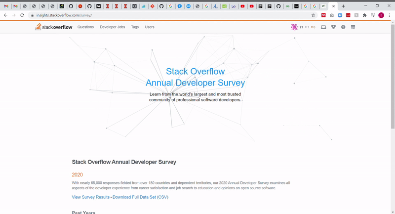

# Final Project Proposal: Nearest Neighbor Network Music Visualizer
___
### Background
In this project I will create an interactive nearest neighbor network graph that 
will additionally be able to interface with music, changing it's shape and properties
in accordance with various aspects of the music as well as through user input. 

This idea draws inspiration from two sources. First from the [StackOverflow Developer
                                                              Survey website](https://insights.stackoverflow.com/survey/).
 (This can be seen below).

 
 In general, I just really enjoy this visually; the nodes floating through space,
 connecting to their nearest neighbors, and the ability for the user to introduce
 new connections through mouse input. 
 
 The second piece of inspiration was received from a [past project](https://github.com/Leundai/Vibing-Audiovisual)
  performed by Leonardo Galindo. In this project he creates a visual landscape that changes
  with the beat of the music. 
  
  With my project I would like to do a composition of these two ideas; have a 
  nearest-neighbor network graph not only interacts with user inputs but also
  with music should the user choose to provide some.
  ___
  
  ### Features
  * Interactive Nearest-Neighbor Network Graph
    * Each node connects to it's nearest neighbors while floating through space.
    The strength of the connection is defined by the proximity of its neighbor with
    darker lines indicating a stronger connection and lighter lines indicating
    weaker ones
    * User controls
        * The mouse will serve as a node itself, making connections with it's nearest
        neighbors as it moves across the screen
        * The user will be able to additionally control features of the nodes such
        as connection sensitivity, speed, and color.
 * Music Player
    * The program will prompt the user for a music file to play (and the user can
    decline if they so choose). 
    * While music is playing, node connection sensitivity will be scaled variably 
    with the beat of the music and the magnitude of this scaling can be altered 
    with user input
  ---
  ### Timeline
  
  #### Week1 - Graphical Map
  * Project set-up
  * Set dimensions of the visualizer
  * Generate nodes and positioning
  * Locating a node's nearest neighbor
  * scaling connection strength
  * Interactive mouse input functionality
  
  #### Week2 - Music Player Integration
  * Upload music
  * Play music
  * Music player and graphical map interaction
  * Music decomposition into key components
  * Scale map interactions with desired musical components
  
  #### Week 3 - Graphical User Interface
  * Visually create user controls (sliders, buttons, etc.)
  * Implement speed change functionality
  * Implement color selection functionality
  * Implement slider control of connection sensitivity
  
  ___
