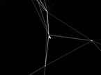
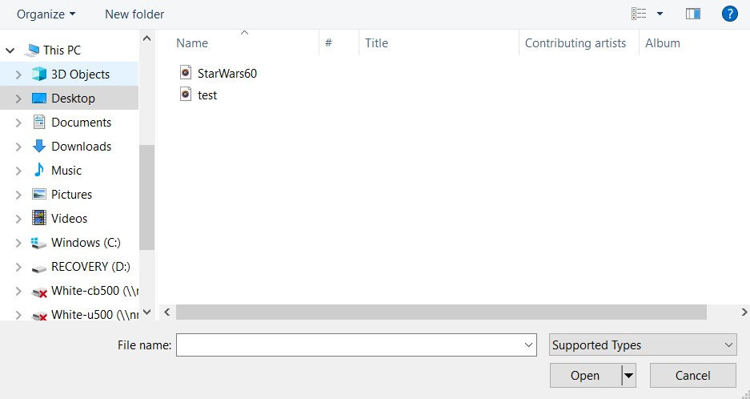
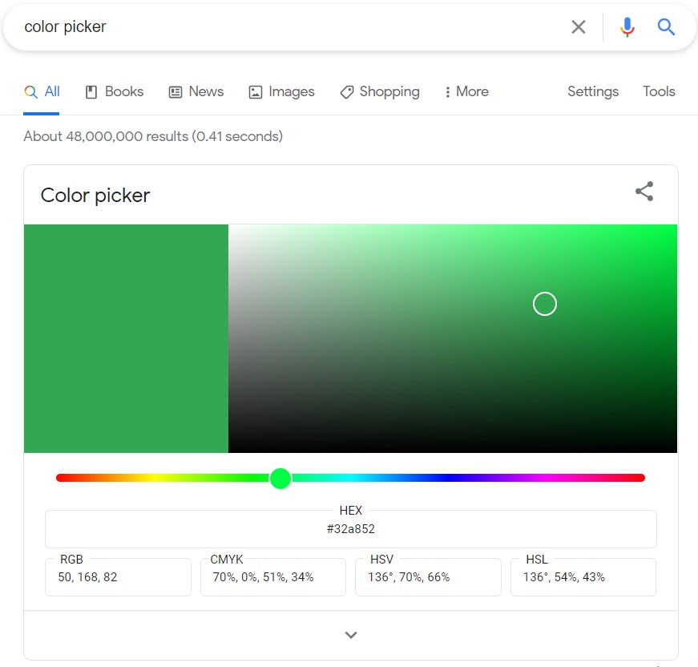
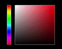

# Audio Connection Visualizer
---
## About
#### General
Audio connection graph is a fun visualization that can be paired with or without music. The basic functionality
of the app includes generating random nodes that float through space. These nodes make connections with their
nearest neighbors and you too can create connections with other nodes through mouse inputs.

#### Node Interaction
Nodes interact with their nearest neighbors which includes a node generate by mouse location. These connections between
nodes are variable and scale in intensity based on distance between the two nodes and root mean squared volume of the
music playing in the background.
###### Demo - Distance Scaling

#### Using Music
The app is designed to be used with music but will function (just display a non-musically dynamic graph)
without music provided by the user.   Upon starting up the application, you will be prompted for a file input of 
which you can choose any .mp3 or .wav file. Immediately the music will start. Node connection strength is scaled based on the RMS (root mean squared) volume of the music. You also have the option to select "Cancel" from the prompt
above and the display will begin without any music scaling.

#### User Controls - Color Picking
The app has some user input controls. Outside of mouse inputs for generating new connections, there are two
color pickers displayed on the screen for changing the colors of the display. These color pickers mimick the styling 
format of Google's color picker  The upper color picker will
allow you to change the overall background color while the color picker below will allow you to change the 
node and connection color. In order to change the base color of the color picker, simply click on the color bar to the 
left on the desired color

###### Demo - Color Picking

---
## Full Demo - Without Music

## Full Demo - With Music

---
## Set-Up
#### Cinder
This project was developed through C++'s Cinder platform. It was written using the latest version
of cinder found [here](https://github.com/cinder/Cinder). 

#### Quick Start
After downloading Cinder, clone the repo in a folder inside Cinder. Build project, 
run, choose music (or not), and enjoy!
